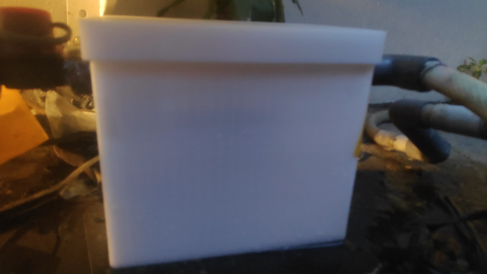

# wasser_pb60ea
A parametric 3D-printable rain protector for the Wasser PB-60EA booster pump, designed in OpenSCAD. The two-piece design features a body with 5mm floor, 3mm walls, and horseshoe cutouts on opposite sides for pipe routing, plus a snap-fit lid with a 15mm outer grip skirt. Fully parametric — adjust dimensions, cut sizes, and clearances with ease.

## Example Result

## Recommended Filament

Using **TPU filament** is recommended for printing this protector. TPU is flexible enough to make it easy for cleaning — when you need to insert something to wipe the interior of the box, the walls will flex slightly rather than resist, allowing thorough maintenance without risking damage to the print.
